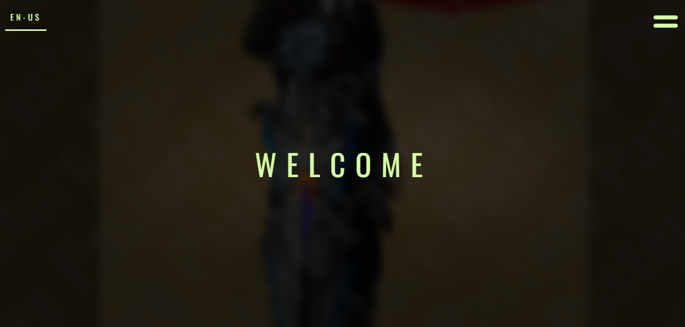

# 👋 Bem-vindo/welcome!
## 👦 Sobre Mim/About Me
```html
<name> Gabriel Pastore </name>
<from> Guarulhos - São Paulo </from>
<age> 22 years old </age>
<work-as>
  <role> Game Dev </role>
  <role> Web Dev </role>
  <role> Designer </role>
  <role> Video Editor </role>
</work-as>
<academic-background>
  <course> IT Technician Course at Colégio ENIAC (2018-2020) </course>
  <course> Computer Science bachelor's degree at Universidade São Judas Tadeu (2021-2025) </course> 
</academic-background>
```
## 💻 Ferramentas que uso/Tools that I work with
<p align="left">
  
  
  
  
  
  
  
  
  
  
  
  
  
  
</p>

## 🎯 Minha atividade no GitHub/My GitHub activity
[](https://github.com/anuraghazra/github-readme-stats)

[](https://github.com/anuraghazra/github-readme-stats)

## Contato, Portfólio e mais/Contact, Portfolio and more
[](https://gapastore.github.io/portfolio-gabriel-pastore/)

[]([https://gapastore.github.io/portfolio-gabriel-pastore/](https://www.linkedin.com/in/gabriel-pastore-b11506206/))

[](https://gapastore.github.io/portfolio-gabriel-pastore/)

[](https://spotify-github-profile.kittinanx.com/api/view?uid=dfdf2cvfhqnfyg4fc9e5kcbe5&redirect=true)

